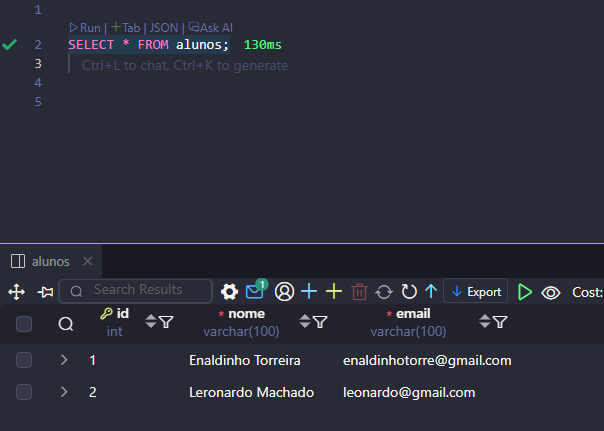

# 📚 Sistema de Cadastro de Alunos (PHP + MySQL)


## Sumário
- [Recursos](#recursos)
- [Pré-requisitos](#pré-requisitos)
- [Instalação](#instalação)
- [Banco de Dados](#banco-de-dados)
- [Executando](#executando)
- [Estrutura](#estrutura)
- [Conceitos Importantes](#conceitos-importantes)
- [Troubleshooting](#troubleshooting)
- [Licença](#licença)
- [Capturas de Tela](#capturas-de-tela)

Este é um pequeno projeto desenvolvido para praticar **desenvolvimento backend com PHP e MySQL**. O sistema permite cadastrar alunos e visualizar a lista de alunos cadastrados em uma página web.

## Recursos

- Cadastro de alunos (nome e email)
- Armazenamento de dados em banco **MySQL**
- Listagem dinâmica dos alunos cadastrados
- Conexão segura com o banco utilizando **PDO**
- Uso de **variáveis de ambiente (.env)** para configuração do banco

## Pré-requisitos

- PHP 8+
- MySQL 8+ (ou compatível)
- Servidor web (Apache, Nginx, ou embutido no PHP)

## Instalação

```bash
git clone https://github.com/DaviDetroit/php-crud-alunos.git
```

## Banco de Dados

Crie o banco de dados e a tabela básica:

```sql
CREATE DATABASE escola;

CREATE TABLE alunos (
  id INT AUTO_INCREMENT PRIMARY KEY,
  nome VARCHAR(100),
  email VARCHAR(100)
);
```

## Executando

1. Configure o arquivo `.env`:

```env
DB_HOST=localhost
DB_PORT=3306
DB_NAME=escola
DB_USER=root
DB_PASSWORD=
```

2. Execute o projeto no servidor local (ex: **Laragon, XAMPP ou WAMP**):

```
http://localhost/escola
```

## Estrutura

```
.
├─ config.php      # Conexão com o banco de dados
├─ cadastrar.php   # Formulário para cadastrar aluno
├─ salvar.php      # Script responsável por salvar no banco
├─ index.php       # Página que lista os alunos
├─ .env            # Variáveis de ambiente do banco
└── README.md      # Este arquivo
```

## Conceitos Importantes

- Conexão PDO:
  - Utiliza PDO para conexão segura com MySQL, prevenindo SQL injection
- Variáveis de ambiente:
  - Credenciais do banco ficam no arquivo `.env`, não expostas no código
- Arquitetura MVC simples:
  - Separação entre lógica (salvar.php), visualização (index.php) e configuração

## Troubleshooting

### Problemas comuns

1. **Erro de conexão com o banco**
   - Verifique se o MySQL está rodando
   - Confirme as credenciais no arquivo `.env`
   - Teste a conexão manualmente com o MySQL

2. **Página em branco**
   - Verifique se as extensões PHP necessárias estão instaladas
   - Habilite exibição de erros no php.ini
   - Confirme se o servidor web está configurado corretamente

3. **Dados não salvam**
   - Verifique permissões de escrita no diretório
   - Confirme se a tabela `alunos` existe no banco
   - Verifique se o formulário está enviando dados corretamente

## Licença

MIT


### Demonstração do Sistema



💻 Projeto desenvolvido como parte dos meus estudos em programação e banco de dados.